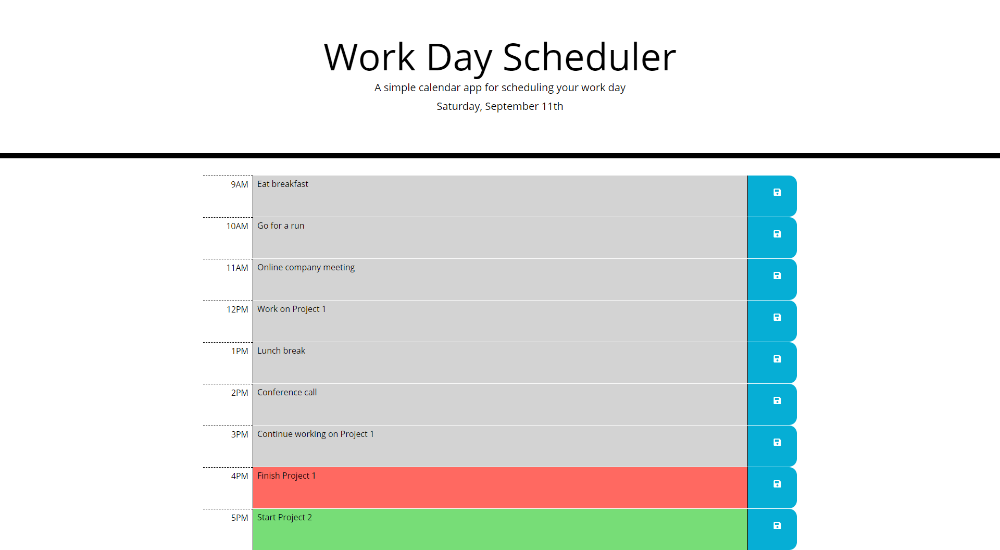

# Work Day Scheduler
A daily planner to help users manage their time and tasks efficiently.

https://kg-phantom.github.io/work-day-scheduler/

## Times
The application uses Moment.js to process dates and times.

The date is displayed at the top of the page and there are time blocks for standard business hours.

The date is also updated every 30 minutes.

## Time Blocks
The time blocks are color-coded to indicate whether it is in the past, present, or future.

Upon clicking on a time block, the user can enter and save an event in that time block.

The color coding of the time blocks are updated every 15 minutes.

## Data Persistence
The application utilizes `localStorage` to save event data and display the saved data after the page is refreshed or reopened.